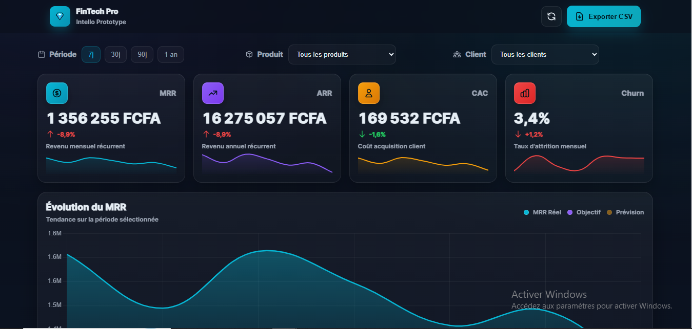
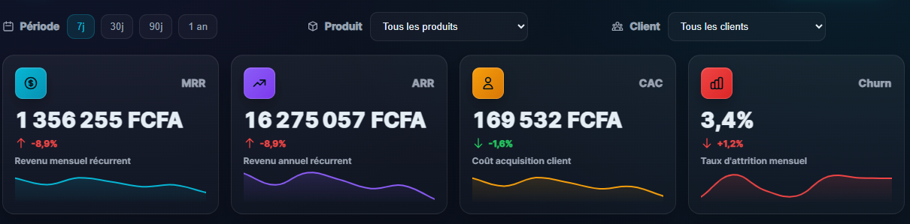

# 💎 FinTech Dashboard Pro

Dashboard financier interactif avec visualisations temps réel — Prototype premium par [Intello](https://intello.sn).

---

## ✨ Fonctionnalités

- **📊 KPIs animés** : MRR, ARR, CAC, Churn avec animations CountUp
- **📈 Charts interactifs** : Visualisation Chart.js (MRR réel, objectif, prévision)
- **⚡ Sparklines** : Mini-graphiques temps réel pour chaque métrique
- **🔍 Table clients** : Recherche live, tri dynamique, filtres
- **💾 Export CSV** : Téléchargement des données
- **🎨 Design glassmorphism** : Gradients fluides, animations subtiles
- **📱 Responsive** : Optimisé mobile/tablette/desktop

---

## 🛠️ Stack technique

- HTML5 + CSS3 (variables, gradients, animations)
- JavaScript ES6+ vanilla
- Chart.js 4.4 (graphiques)
- CountUp.js 2.8 (animations)

---

## 🚀 Installation

### Ouvrir directement
Double-cliquez sur `index.html`

### Avec serveur local

```bash
# Cloner le repo
git clone https://github.com/intello-agence/fintech-dashboard-prototype.git
cd fintech-dashboard-prototype

# Lancer serveur (choisir une méthode)
python -m http.server 8000
# OU
npx http-server -p 8000
# OU utiliser l'extension "Live Server" de VS Code
```

Puis ouvrir `http://localhost:8000`

---

## 📸 Screenshots

### Dashboard principal


### KPIs & Sparklines


### Table clients


## 📦 Structure

```
fintech-dashboard-prototype/
├── index.html      # Structure HTML
├── styles.css      # Styles (glassmorphism, animations)
├── app.js          # Logique + Chart.js
└── README.md       # Documentation
```

---

## 🎮 Utilisation

- **Filtres période** : 7j / 30j / 90j / 1 an
- **Filtres produit** : Premium / Business / Enterprise
- **Filtre client** : Alpha / Beta / Gamma
- **Bouton Refresh** : Régénère les données
- **Export CSV** : Télécharge MRR + clients

---

## 🎨 Personnalisation

Les données sont générées aléatoirement. Pour connecter une API :

```javascript
// Dans app.js, remplacer genData() par :
async function fetchData(period) {
  const res = await fetch(`/api/mrr?period=${period}`);
  return res.json();
}
```

---

## 📄 Licence

MIT License

---

## 👤 Auteur

**Intello** — Agence digitale Dakar 🇸🇳

- 🌐 [intello.sn](https://intello.sn)
- 📧 intellopjsn@gmail.com
- 📱 +221 77 553 28 04

---

**Fait avec ❤️ à Dakar**
```